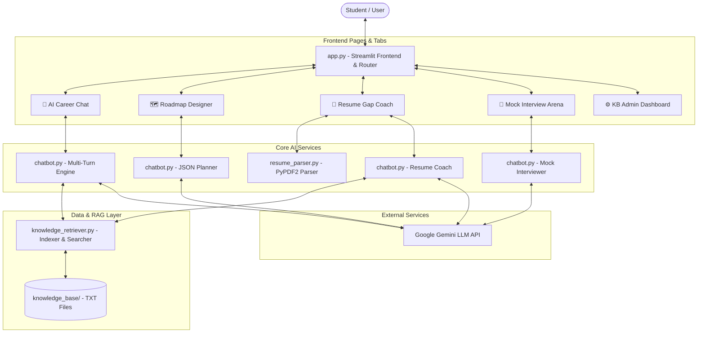

# EduPath AI Career Mentor Chatbot - Detailed Documentation

This documentation covers the design, engineering architecture, and prompt methodologies implemented to build **EduPath AI**, a premium AI-powered Career Mentor Chatbot for students and career switchers.

---

## 1. Project Architecture

The application is built entirely on Python, utilizing the **Streamlit** framework for high-fidelity front-end rendering and **Google Gemini (Gemini 2.5 Flash)** as the cognitive intelligence layer.

### System Topology
The following component diagram illustrates the structure of the system and user flows:

---

## 2. AI Workflow & Retrieval-Augmented Generation (RAG)

EduPath AI implements a custom local **RAG (Retrieval-Augmented Generation)** framework to ensure career advisory details are grounded in verified knowledge domains (like AgriTech, Food Tech, Data Science, and Higher Education schemas) rather than hallucinated by the model.

### Process Flow
1. **Query Inspection**: The student submits a question (e.g., *"What certifications should I take for Food Technology?"*).
2. **Context Detection & Mapping**: The `knowledge_retriever.py` module indexes all text profiles inside the `knowledge_base/` folder. It compares nouns, technical topics, and user query components against pre-defined keywords and term counts.
3. **Retrieval & Grounding**: Upon detecting relevant topics (e.g. keywords matching `food_technology.txt` and `higher_education.txt`), the retriever extracts the exact verified texts from these documents.
4. **Context Injection**: The retrieved text blocks are dynamically appended to the LLM system instructions as **Grounding Context**.
5. **Generation**: The Gemini API compiles the prompt, utilizing context limits, conversation history, and student profile preferences, generating a factually accurate, structured response.

---

## 3. Prompt Engineering Strategy

To guide LLM outputs for diverse interactive modes (chats, JSON mapping, simulated interviews), a segmented prompt architecture was created:

### A. Role Grounding (`SYSTEM_PROMPT`)
- **Objective**: Establish persona constraints (empathic, professional AI Career Mentor).
- **Techniques**: Negative constraints (e.g., *"Ask only one or two follow-up questions at a time"*), strict formatting instructions (headers, bold tags), and multi-language alignment guidelines.

### B. Structured Outputs & Schema Enforcement (`ROADMAP_PROMPT`)
- **Objective**: Generate complex career timelines that can be parsed and styled dynamically in Streamlit.
- **Techniques**: Strict JSON schema declaration combined with Gemini's `response_mime_type: "application/json"` capability. This forces the model to structure phases, recommended resources, and milestones into a standardized JSON packet, preventing formatting corruption.

### C. Feedback & Grading Loops (`INTERVIEW_PROMPT` & `RESUME_FEEDBACK_PROMPT`)
- **Objective**: Provide objective scores, list specific technical gaps, and construct the next question.
- **Techniques**: Clear section heading enforcement, rating limits (e.g. percentage scores or 1-10 marks), and conversational transitions.

---

## 4. Knowledge Base Creation & CRUD

The knowledge base is structured as a modular collection of plain-text `.txt` document profiles stored in the `knowledge_base/` directory.

### Document Hierarchy
Each document contains structured entries including:
- **Description**: Domain definitions and societal impact.
- **Technical Skills**: Required stack (languages, libraries, frameworks).
- **Soft Skills**: Collaboration and analytical needs.
- **Certifications**: Industry-recognized designations (like CompTIA, Google, HACCP, AWS).
- **Learning Resources**: Websites, courses, and recommended textbooks.
- **Career Roles**: Job titles (e.g. SOC Analyst, Precision Agriculture Specialist).
- **Higher Education Studies**: Master degrees, abroad destinations, exams (GRE, GATE, CAT).

### The CRUD Admin Dashboard
To satisfy the database updating requirements, a complete administrative tool was built in Streamlit:
- **Create**: Add new career profile text files dynamically from the UI.
- **Read**: Select and display file contents in the Admin editor.
- **Update**: Edit text content and save changes back to disk with a single click.
- **Delete**: Safely remove outdated domain profiles.

---

## 5. Technical Challenges & Solutions

### Challenge 1: LLM Hallucinations in Career Tracks (e.g. Food Technology, AgriTech)
- **Problem**: Popular general LLMs often confuse "Food Technology" with Culinary Arts, or lack precise knowledge on certification bodies (like HACCP, ISO 22000, Erasmus Mundus).
- **Solution**: The local RAG retrieval system intercepts queries and injects verified certification details into the prompt instructions, guaranteeing precise alignment with career goals.

### Challenge 2: Parsing Messy LLM Roadmaps into Elegant UI Visual Timelines
- **Problem**: Getting raw text lists from AI is hard to read and looks generic. But writing standard code to parse arbitrary markdown bullet points is highly error-prone.
- **Solution**: Leveraged Gemini's JSON MIME response feature to output clean JSON. The front-end parses this JSON into a python list and renders it via **beautiful custom HTML & CSS timeline structures** (with custom glass cards, glowing timelines, and capsules), making the roadmap visually premium.

### Challenge 3: Incurring Costs / Setup Complexities for Speech Services
- **Problem**: Python packages like `gTTS` or custom cloud speech APIs require heavy package dependencies, create server-side audio delay, and cost money.
- **Solution**: Built an elegant browser-native solution using the **HTML5 Web Speech API** (Speech Recognition & Speech Synthesis) inside standard iFrames. This relies 100% on the user's browser, runs instantly with zero audio files lag, works offline, and is **completely free of cost**.
